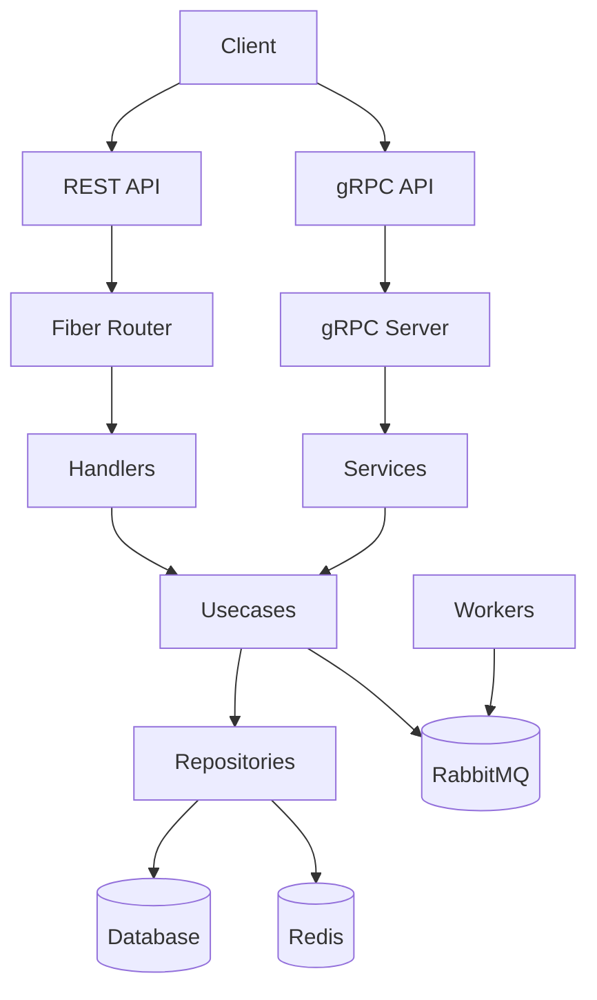

<!-- Improved README.md -->
<div align="center">
  
  
  # Go Hexagonal Architecture Boilerplate
  
  [](https://goreportcard.com/report/github.com/yourusername/go-hexagonal-boilerplate)
  [](LICENSE)
  [](https://golang.org/doc/devel/release.html)
  [](https://github.com/yourusername/go-hexagonal-boilerplate/releases)
  
  **Production-ready boilerplate** for building scalable Go applications using **Hexagonal Architecture** with **REST + gRPC APIs**, **Database Migrations**, **Worker Services**, and **Resilience Patterns**.
  
  <br/>
  
  [Documentation](docs/README_FULL.md) • [API Reference](http://localhost:4001/swagger/index.html) • [Report Bug](https://github.com/yourusername/go-hexagonal-boilerplate/issues) • [Request Feature](https://github.com/yourusername/go-hexagonal-boilerplate/issues)
</div>

---

## 🚀 Key Features

| Feature | Description |
|--------|-------------|
| **🎯 Hexagonal Architecture** | Clean separation of concerns with domain, usecase, repository, and delivery layers |
| **⚡ Dual API Support** | REST API using Fiber and gRPC API from a single codebase |
| **🗄️ Database Support** | MySQL and PostgreSQL with GORM |
| **キャッシング Redis** | Built-in Redis caching support |
| **📬 Message Queue** | RabbitMQ integration for event-driven architecture |
| **🔄 Database Migrations** | Using golang-migrate with versioned SQL scripts |
| **👷 Worker Services** | Separate worker processes with graceful shutdown |
| **🛡️ Resilience Patterns** | Circuit breaker, retry, timeout, bulkhead, rate limiting, deduplication |
| **📋 Structured Logging** | Using Zap logger for production-ready logging |
| **⚙️ Configuration** | Using Viper for environment-based configuration |
| **🔍 Input Validation** | Using Go Playground Validator |
| **📖 API Documentation** | Swagger/OpenAPI documentation |
| **🐳 Containerization** | Docker support for easy deployment |
| **🔄 CI/CD** | GitHub Actions workflows |
| **📖 Pagination** | Offset and cursor-based pagination helpers |
| **📡 Centralized Responses** | Unified API response format with metadata |

---

## 🏗️ Architecture Overview



---

## 🚀 Quick Start

### Prerequisites

- **Go 1.23+**
- **Docker** (for database and message queue services)
- **Docker Compose**

### Installation

```bash
# Clone the repository
git clone https://github.com/yourusername/go-hexagonal-boilerplate.git
cd go-hexagonal-boilerplate

# Copy environment file
cp .env.example .env

# Install dependencies
go mod tidy
```

### Running the Application

```bash
# Development mode with hot reload
make dev

# Production mode
make build
./app-hexagonal

# Run worker services
./app-hexagonal worker
```

---

## 🧪 API Endpoints

### REST API

| Method | Endpoint | Description |
|--------|----------|-------------|
| `GET` | `/api/v1/users/:id` | Get user by ID |
| `POST` | `/api/v1/users` | Create a new user |
| `PUT` | `/api/v1/users/:id` | Update user |
| `DELETE` | `/api/v1/users/:id` | Delete user |
| `GET` | `/health` | Health check |
| `GET` | `/metrics` | Prometheus metrics |

### gRPC API

```protobuf
service UserService {
  rpc GetUser(GetUserRequest) returns (GetUserResponse);
  rpc CreateUser(CreateUserRequest) returns (CreateUserResponse);
}
```

---

## 🛠️ Development Commands

```bash
make run-dev        # Run in development mode with hot reload
make build          # Build the application
make test           # Run tests
make migrate-up     # Run database migrations
make migrate-down   # Rollback database migrations
make proto-gen      # Generate protobuf files
make clean          # Clean build artifacts
```

---

## 📁 Project Structure

```
├── api/                    # API definitions (protobuf files)
├── cmd/                    # Application entry points
│   ├── main.go            # Main application entry point
│   └── worker.go          # Worker service entry point
├── config/                 # Configuration and bootstrapping
├── database/               # Database migrations
├── docs/                   # Documentation files
├── internal/               # Application core (hexagonal architecture layers)
│   ├── delivery/          # Delivery mechanisms (REST, gRPC)
│   ├── domain/            # Business domain models and interfaces
│   ├── helper/            # Helper functions
│   ├── middleware/        # Middleware functions
│   ├── repository/        # Database implementations
│   ├── resilience/        # Resilience patterns
│   └── usecase/           # Business logic
├── pkg/                    # Shared packages
│   ├── gorm/              # GORM helpers (pagination)
│   ├── mysql/             # MySQL connection
│   ├── postgres/          # PostgreSQL connection
│   ├── rabbitmq/          # RabbitMQ connection
│   └── redis/             # Redis connection
└── test/                   # Test files
```

---

## 🤝 Contributing

Contributions are what make the open source community such an amazing place to learn, inspire, and create. Any contributions you make are **greatly appreciated**.

1. Fork the Project
2. Create your Feature Branch (`git checkout -b feature/AmazingFeature`)
3. Commit your Changes (`git commit -m 'Add some AmazingFeature'`)
4. Push to the Branch (`git push origin feature/AmazingFeature`)
5. Open a Pull Request

---

## 📄 License

Distributed under the MIT License. See [LICENSE](LICENSE.txt) for more information.

---

## 🙏 Acknowledgements

- [Go](https://golang.org/)
- [Fiber](https://gofiber.io/)
- [GORM](https://gorm.io/)
- [gRPC](https://grpc.io/)
- [Viper](https://github.com/spf13/viper)
- [Zap](https://github.com/uber-go/zap)
- [Docker](https://www.docker.com/)